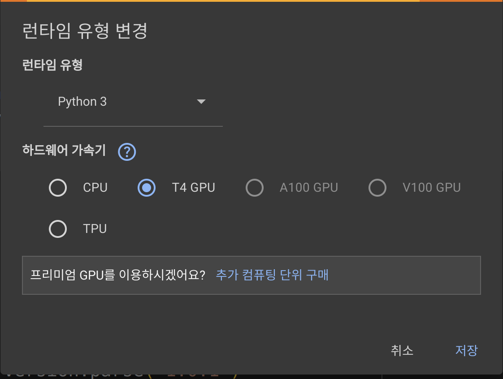

# advanced_ann
숭실대 전자정보공학부 IT융합전공 고급인공신경망 수업 (권민혜 교수, 조무곤 조교)

# 2024 advanced_ann Tool Installation Guide
## 1. CoLab 활용 방법
1. 다음 링크로 구글 CoLab 접속 (https://colab.research.google.com/)
2. 새로운 Jupyter notebook 파일 생성 또는 컴퓨터에 저장된 Jupyter notebook 파일 업로드
3. [런타임]-->[런타임 유형 변경]-->T4 GPU 선택
   
4. 각 cell 실행
5. 저장하기: File -> download .jpynb -> save the file

---
